# Flappy Bird 的 C# 实现


灰常辣鸡的一个普通大学课设，感觉没怎么用心做那个时候 = = 。
(A Simple project about C#, Flappy Bird.)


## 一、 概述


### 1.项目背景


网络给人们生活带来便利的同时，也为人们带来了新的消遣方式：电子游戏。一个运行良好且具有良好的可延展性的电子游戏设计是很能反应学生的综合能力的。对于Visual Studio平台而言，结合C#图形界面的便捷设计更为创作者提供了良好的平台。电子游戏反应的是人们另一种方面上的精神追求，在虚拟世界中体验现实生活中体会不到的兴趣，是人们社会生活的产物，反应了人们情绪性的变化。而这一切的实现与构成基础就是一行行的低层代码，化枯燥于有趣，化娱乐为学习目的，能构成更好的正反馈。


### 2.编写目的


Flappy Bird是一个极其经典的游戏，在不久前还掀起过一阵电子游戏“复古”风潮，游戏本身的娱乐性就已经足够人们去研究与探索了，而去思考与学习如何实现这个游戏，游戏内的机制涉及到多少位置的判断，也是一个有趣的挑战。对于个人来说，兴趣方向更倾向于计算机图形与人机交互的方面，而C#优秀的窗体设计，能够使枯燥的程序语言很及时的反馈到视觉层面，是很好的对人反应，作为媒介，让人更加有兴趣去思考与学习。


一切游戏理论都是在前面那句话的基础上，针对不同用户对不同正反馈期望，以及他们可以付出的成本，所展开的的具体研究。虽然是个小游戏，但是其中涉及到的窗体界面互相调用以及模块化的设计都是对C#学习的极大提高。


### 3.软件定义


基于交互式模块化设计的电子游戏——Flappy Bird


### 4.开发环境


Visual Studio 2017，C#


 

## 二、 需求分析


### 1.   用户登陆系统


使用Visual Studio自带的优秀且便利的数据库链接方式，通过C#语言进行数据库的链接，实现玩家的登陆与注册及数据保存


### 2.   登陆界面实现


使用C#窗体设计，构建出较简单的登陆及注册界面，输入出错的反馈提示界面


### 3.   游戏窗口设计


使用C#窗体设计，构建出较简单的游戏运行界面，保证游戏的正常运行与积分显示，作为游戏机制实现的基础


### 4.   游戏机制设计


根据C#窗体间的绝对与相对位置，构造函数，实现碰撞计算，分数累计，开始与结束的各种判定，面向对象程序设计


### 5.   结算界面实现


调用数据库玩家数据，通过整体数据比对，显示本次游戏结果与历史最高游戏结果，达到界面结算的目的


 

## 三、 系统设计


### 1.思维示意图

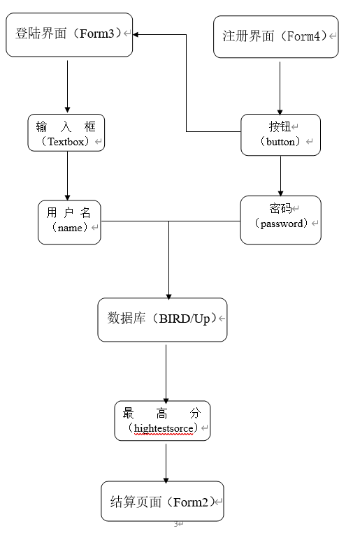 


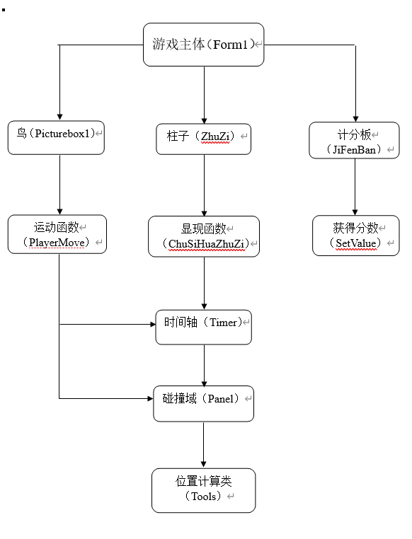 


### 2.玩家设计


需要玩家角色在点击按钮后，角色方块先减速上升，再加速下降；再次点击恢复初始速度上升，如此点击循环：

```
public void PlayerMove(Control c,int dx,int dy)
	{
		Point p = c.Location;
		p.Offset(dx, dy);
		c.Location = p;
	}
```


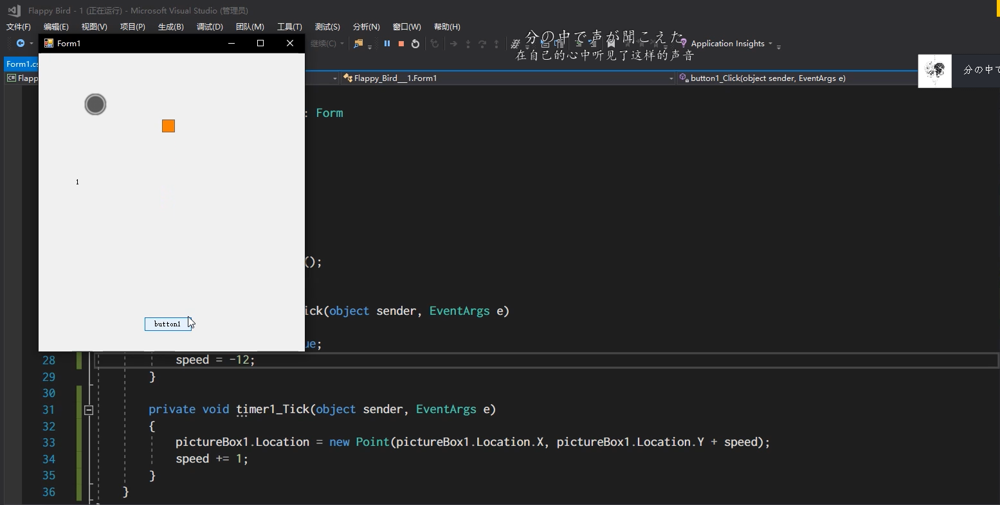

图2-1 玩家方块的初步设计


### 3.柱子初步设计


因为不使用贴图的原因，所以柱子的制作要靠控件构造实现，于是想办法构建具有特性引用的控件——柱子：

```
public void ChuShiHuaZhuZi()
	{
		zhuzis = new ArrayList();
		for (int i = 0; i < 3; i++)\
		{
			if (i == 0)
			{
				zhuzi zz = new zhuzi();
				zz.Location = new Point(panel1.Width, 0);
				zz.Location = new Point(zz.Location.X, random.Next(-200, -1));
				panel1.Controls.Add(zz);
				zhuzis.Add(zz);
			}
			else
			{
				zhuzi before = (zhuzi)zhuzis[i - 1];
				zhuzi zz = new zhuzi();
				zz.Location = new Point(before.Location.X + zhuzijianju, 0);
				zz.Location = new Point(zz.Location.X, random.Next(-200, -1));
				panel1.Controls.Add(zz);
				zhuzis.Add(zz);
			}
		}
	}
```


图3-1 柱子的初步设计


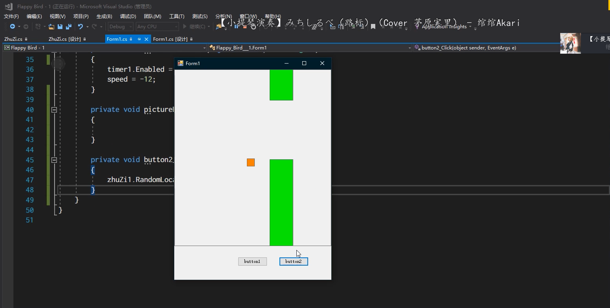

图3-2 柱子的垂直运动


### 4.柱子的水平生成

玩家的点击操作只控制方块的Y轴移动，通过柱子的X轴移动，达到玩家方块水平移动的效果；再通过计算整个窗体的长宽，设计柱子的生成高度，对随机函数的范围进行设计：

```
private void Timer1_Tick(object sender, EventArgs e)
        {
            if (isOver)
            {
                Player.Dispose();
                return;
            }
            if (Player.Location.Y + speed < 0)
            {
                speed++;
                return;
            }
            PlayerMove(Player, 0, speed);
            speed++;

            if(Player.Location.Y > panel1.Height) 
            {
                GameOver();
            }
        }

```


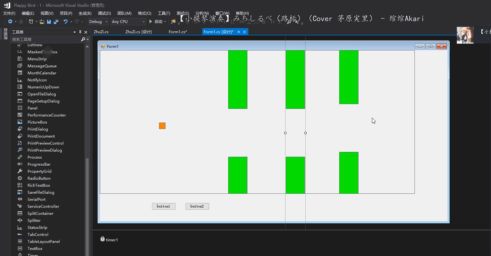

图4-1 柱子的水平运动


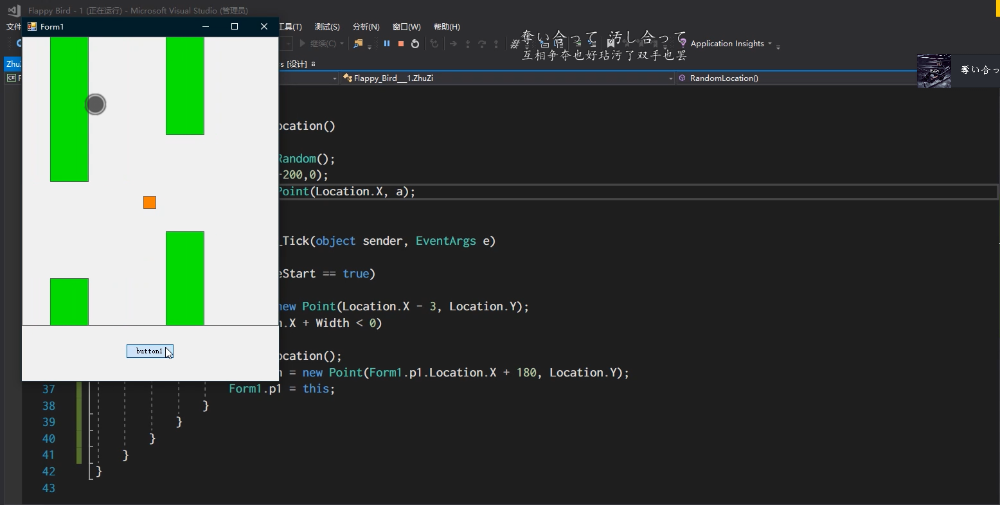

图4-2 柱子的随机生成


### 5.计分板读分设计


计分板需要实时显示玩家的得分情况，即需要和碰撞得分域相互绑定，这样的显示功能是没有控件具备的，于是再次自己定义构造新控件：

```
public void SetValue(int v)
        { 
            string vv;
            if(v < 10)
            {
                vv = "0" + v.ToString();
            }
            else
            {
                vv = v.ToString();
            }
            label1.Text = vv;
        }
```


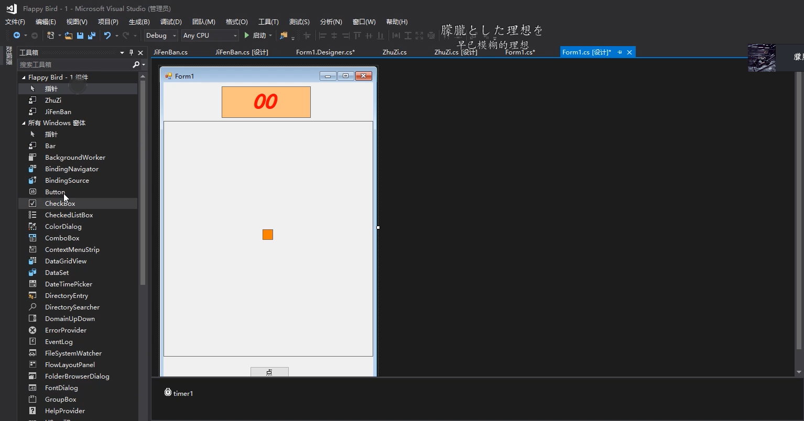

图5-1 计分板控件设计


### 6.碰撞函数设计


在探索碰撞定义的过程中发现，窗体的左上角是所有控件坐标的（0，0）点，即向下向右移动时，控件拥有的位置属性坐标值讲增大，当这个数值达到固定位置控件的坐标数值时，就会发生碰撞，且这些在X轴与Y轴的反应上，一定是同步发生的：

```
private void Movetimer_Tick(object sender, EventArgs e)
        {
            if (Form1.f1.isOver)
            { 
                Form1.zhuzis.Clear();
                Dispose();
                return;
            }
            if(Location.X < -Width)
            {
                int[] dx = new int[3];
                int index = 0;
                foreach(zhuzi zz in Form1.zhuzis)
                {
                    dx[index] = zz.Location.X;
                    index++;
                }
                int max = dx.Max();
                Location = new Point(max + Form1.zhuzijianju, Form1.random.Next(-200, -1));
            }
            Point p = Location;
            p.Offset(-speed, 0);
            Location = p;public static bool isOverLap(Control c1, Control c2)
        {
            return c1.Location.X + c1.Width > c2.Location.X && c1.Location.Y + c1.Height > c2.Location.Y && c2.Location.X + c2.Width > c1.Location.X && c2.Location.Y + c2.Height > c1.Location.Y;
        }

        public static bool isOverLapC1(Control c1, Control c2)
        {
            return c1.Location.X + c1.Parent.Location.X + c1.Width > c2.Location.X && c1.Location.Y + c1.Parent.Location.Y + c1.Height > c2.Location.Y && c2.Location.X + c2.Width > c1.Location.X + c1.Parent.Location.X && c2.Location.Y + c2.Height > c1.Location.Y + c1.Parent.Location.Y;
        }
```


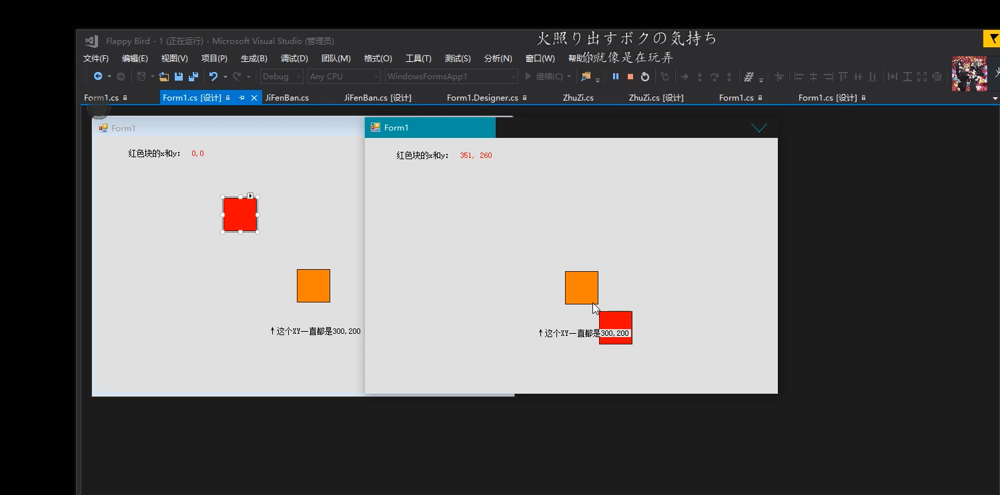

图6-1 控件位置相互关系初探


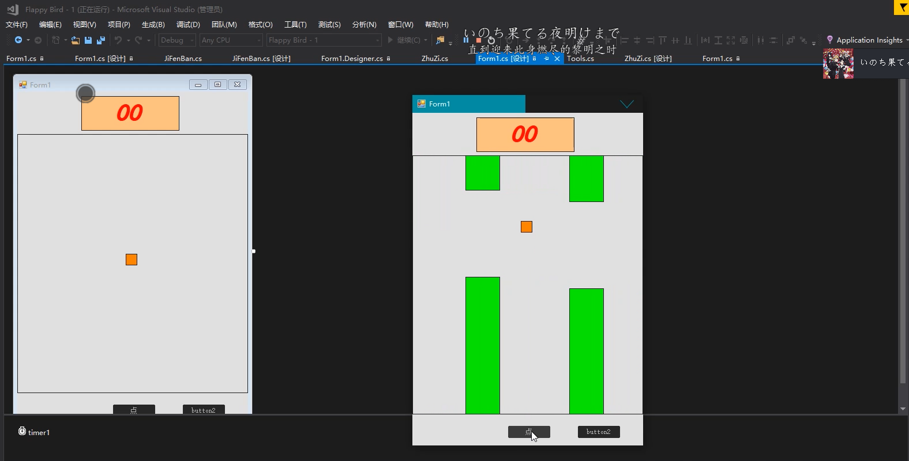

图6-2 碰撞函数柱子实验


### 7.碰撞域设计


玩家得分就是要越过柱子间的空隙，但是不能碰到上下两端，即可以在两柱子的间隙间设置一个透明的控件，作为碰撞域，当玩家方块与之碰撞时，计算得分，且通过这个控件的宽度设计和位置设计，也是改变游戏难度的一种方式：

```
if(Tools.isOverLapC1(TriggerMid, Form1.f1.Player))
            {
                if (!isScore)
                {
                    Form1.f1.score++; 
                    Form1.f1.jiFenBan1.Value = Form1.f1.score;
                    isScore = true;
                }
            }
            else
            {
                isScore = false;
            }

            if (Tools.isOverLapC1(up, Form1.f1.Player))
            {
                Form1.f1.GameOver();
            }
            if (Tools.isOverLapC1(down, Form1.f1.Player))
            {
                Form1.f1.GameOver();
            }
```


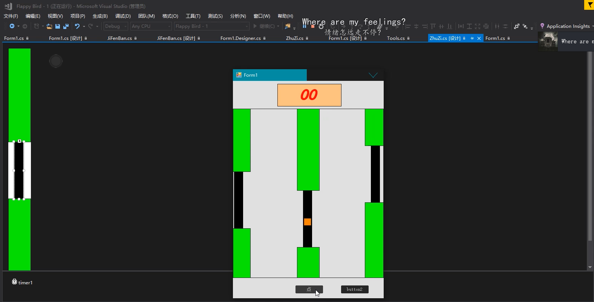

图7-1 碰撞域绑定测试


### 8.结算画面初步


结算画面采取分区间显示得分的做法，通过不同分数区间显示不同的表情包达到激励游戏游玩的目的：

```
public void ChangeScore()
        {
            Hide();
            label1.Text = score.ToString();
            if(score < 30)
            {
                label4.Text = "30";
            }
            else
            {
                label4.Text = score.ToString();
            }
            if (score >= 0 && score < 10)
            {
                pictureBox1.Image = Image.FromFile("10.png");
            }
            if (score >= 10 && score < 20)
            {
                pictureBox1.Image = Image.FromFile("20.png");
            }
            if (score >= 20 && score < 30)
            {
                pictureBox1.Image = Image.FromFile("30.png");
            }
            if (score >= 30 && score < 40)
            {
                pictureBox1.Image = Image.FromFile("40.png");
            }
            if (score >= 40)
            {
                pictureBox1.Image = Image.FromFile("50.jpg");
            }
        }
```


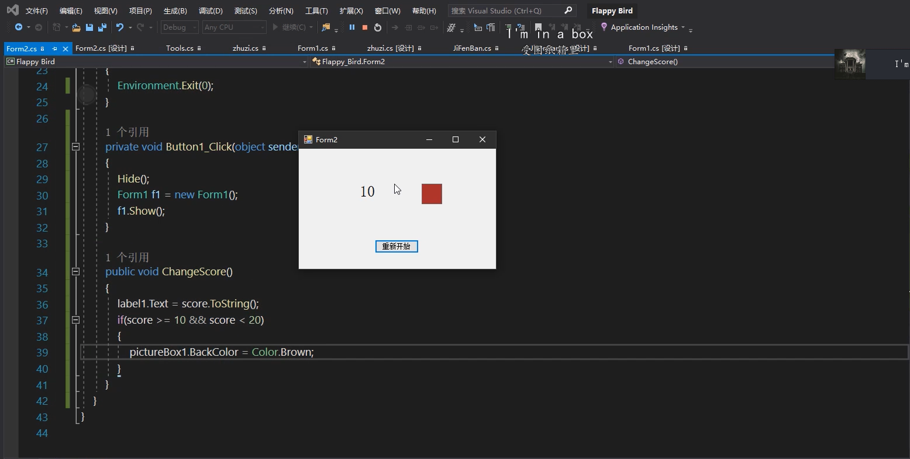

图8-1 结算画面初步

 

## 四、程序实现


### 1.数据库链接

```
private void button1_Click(object sender, EventArgs e)
        {
            String name, password;
            name = textBox1.Text;
            password = textBox2.Text;
            String myconn = @"Data Source=IBN5100\SQLEXPRESS;Initial Catalog=BIRD;Integrated Security=True";//数据库实例连接字符串
            SqlConnection sqlConnection = new SqlConnection(myconn);//新建数据库连接实例
            sqlConnection.Open();//打开数据库连接
            String sql = "select name,password from Up where name='" + name + "'and password='" + password + "'";//SQL语句实现表数据的读取
            SqlCommand sqlCommand = new SqlCommand(sql, sqlConnection);
            SqlDataReader sqlDataReader = sqlCommand.ExecuteReader();
            DataSet ds = new DataSet();
            SqlDataAdapter adapter = new SqlDataAdapter(sql, myconn);
            adapter.Fill(ds, "hightest");
            hightestscore = ds.Tables[0].ToString();

```


### 2.登陆与注册输入判别

```
try
            {
            if (sqlDataReader.HasRows)//满足用户名与密码一致，进入下一个界面
                {
                    Form1 form1 = new Form1();
                    form1.Show(); 

                    this.Hide();
                }
                else//如果登录失败，询问是否注册新用户
                {
                    DialogResult dr = MessageBox.Show("Sign up？", "Failed in.", MessageBoxButtons.YesNo, MessageBoxIcon.Question);
                    if (dr == DialogResult.Yes)//打开注册界面
                    {
                        Form4 form4 = new Form4();
                        form4.Show();
                        this.Hide();
                    }
                    else
                    {
                        this.Show();
                    }
                }
            }catch (Exception msg)
                {
                    throw new Exception(msg.ToString());  //处理异常信息
                }
           }

private void button1_Click(object sender, EventArgs e)
        {
            String name, password, repassword;
            name = textBox1.Text;
            password = textBox2.Text;
            repassword = textBox3.Text;
            if (password == repassword)//两次输入的密码一致
            {
                string myConn = @"Data  
Source=IBN5100\SQLEXPRESS;Initial Catalog=BIRD;Integrated Security=True";
                SqlConnection sqlConnection = new SqlConnection(myConn);  //实例化连接对象
                sqlConnection.Open();

                String sql = "INSERT INTO Up(name,password) VALUES('" + name + "','" + password + "')";//SQL语句向表中写入数据
                SqlCommand sqlCommand = new SqlCommand(sql, sqlConnection);
                sqlCommand.ExecuteNonQuery();
                MessageBox.Show("Success!");

            }
            else
            {
                MessageBox.Show("Password is not same.");
            }
        }
```


### 3.玩家运动函数

```
public void PlayerMove(Control c,int dx,int dy)
        {
            Point p = c.Location;
            p.Offset(dx, dy);
            c.Location = p;
        }
```


### 4.柱子初始化

```
public void ChuShiHuaZhuZi()
        {
            zhuzis = new ArrayList(); 

            for (int i = 0; i < 3; i++)
            {
                if (i == 0)
                {
                    zhuzi zz = new zhuzi();
                    zz.Location = new Point(panel1.Width, 0);
                    zz.Location = new Point(zz.Location.X, random.Next(-200, -1));
                    panel1.Controls.Add(zz);
                    zhuzis.Add(zz);
                }
                else
                {
                    zhuzi before = (zhuzi)zhuzis[i - 1];
                    zhuzi zz = new zhuzi();
                    zz.Location = new Point(before.Location.X + zhuzijianju, 0);
                    zz.Location = new Point(zz.Location.X, random.Next(-200, -1));
                    panel1.Controls.Add(zz);
                    zhuzis.Add(zz);
                }
            }
        }
```


### 5.分数显示

```
int value = 0;

        public int Value
        {
            get => value;
            set 

            {
                this.value = value;
                SetValue(value);
            }
        }
        public void SetValue(int v)
        {
            string vv;
            if(v < 10)
            {
                vv = "0" + v.ToString();
            }
            else
            {
                vv = v.ToString();
            }
            label1.Text = vv;
        }
```


### 6.时间轴运行

```
private void Timer1_Tick(object sender, EventArgs e)
        {
            if (isOver)
            {
                Player.Dispose();
                return;
            }
            if (Player.Location.Y + speed < 0)
            {
                speed++;
                return; 

            }
            PlayerMove(Player, 0, speed);
            speed++;

            if(Player.Location.Y > panel1.Height)
            {
                GameOver();
            }
        }
```


### 7.碰撞域函数及工具类

```
private void Movetimer_Tick(object sender, EventArgs e)
        {
            if (Form1.f1.isOver)
            {
                Form1.zhuzis.Clear();
                Dispose();
                return;
            }
            if(Location.X < -Width)
            {
                int[] dx = new int[3];
                int index = 0;
                foreach(zhuzi zz in Form1.zhuzis)
                {
                    dx[index] = zz.Location.X;
                    index++;
                }
                int max = dx.Max();
                Location = new Point(max + Form1.zhuzijianju, Form1.random.Next(-200, -1)); 

            }
            Point p = Location;
            p.Offset(-speed, 0);
            Location = p;


            if(Tools.isOverLapC1(TriggerMid, Form1.f1.Player))
            {
                if (!isScore)
                {
                    Form1.f1.score++;
                    Form1.f1.jiFenBan1.Value = Form1.f1.score;
                    isScore = true;
                }
            }
            else
            {
                isScore = false;
            }

            if (Tools.isOverLapC1(up, Form1.f1.Player))
            {
                Form1.f1.GameOver();
            }
            if (Tools.isOverLapC1(down, Form1.f1.Player))
            {
                Form1.f1.GameOver();
            }
        }

public class Tools
    { 

        public static bool isOverLap(Control c1, Control c2)
        {
            return c1.Location.X + c1.Width > c2.Location.X && c1.Location.Y + c1.Height > c2.Location.Y && c2.Location.X + c2.Width > c1.Location.X && c2.Location.Y + c2.Height > c1.Location.Y;
        }

        public static bool isOverLapC1(Control c1, Control c2)
        {
            return c1.Location.X + c1.Parent.Location.X + c1.Width > c2.Location.X && c1.Location.Y + c1.Parent.Location.Y + c1.Height > c2.Location.Y && c2.Location.X + c2.Width > c1.Location.X + c1.Parent.Location.X && c2.Location.Y + c2.Height > c1.Location.Y + c1.Parent.Location.Y;
        }
    }
```


## 五、系统测试


### 1.玩家登陆与注册


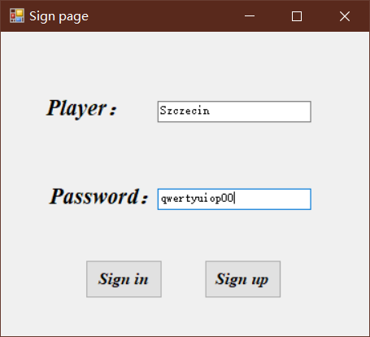

图1-1 正常登陆页面

 

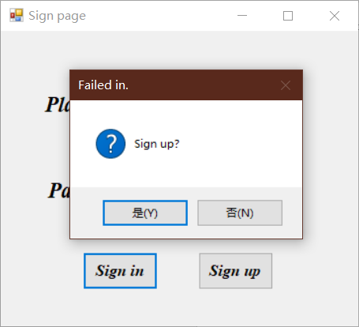

图1-2 登陆失败提示


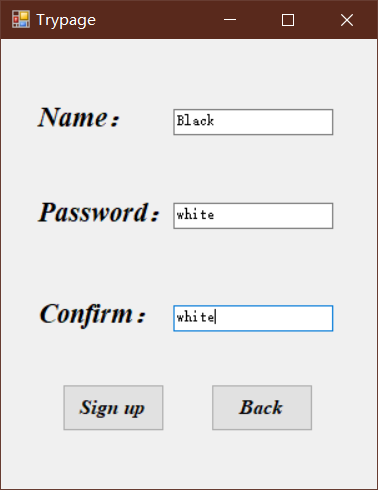

图1-3 注册界面

 

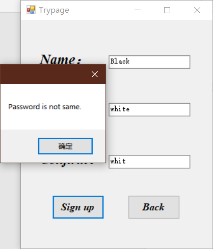

图1-4 注册密码输入不同


### 2.游戏运行


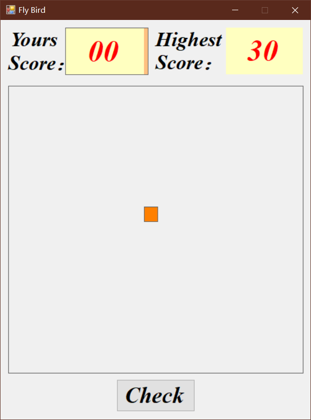

图2-1 游戏主体界面


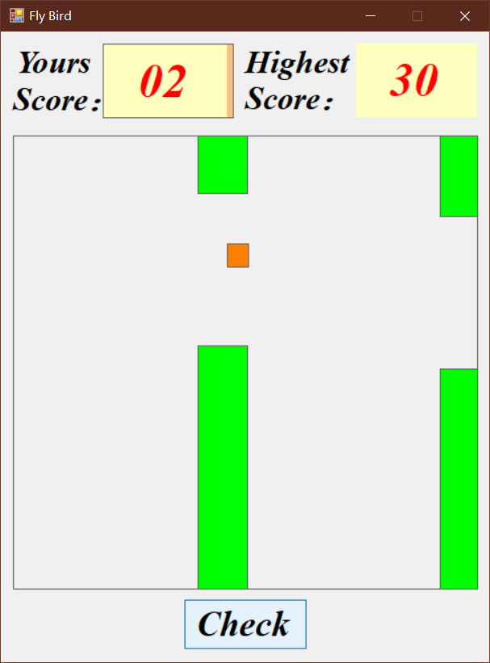

图2-2 游戏运行画面


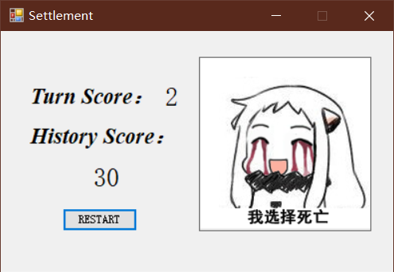

图2-3 结算画面

 

### 3.数据库玩家信息更新


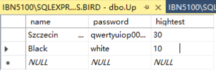

图3-1 数据库资料更新


## 六、总结及设计体会


### 1.总结


对于数据库方面，这次运用到了SqlDataReader和SqlDataAdapter两个数据提取类，前者可对指定查询语句的数据进行读取，后者通过构建虚拟表可以以表形式提取数据；


对于游戏主题实现中，运用到了Timer时间轴代替简单的循环，简化代码的同时充分利用窗口控件；


在游戏机制的实现上，利用C#窗口内各个模块的相对位置上的坐标（x，y）关系，进行逻辑运算后判定，同时运用控件本身自带的属性，进行碰撞域与得分域的构建，在这个过程中定义了新的工具类Tools；


为了单一窗口的简洁，考虑模块化设计，作为游戏部分的计分板JiFenBan和障碍物ZhuZi都是自己进行的控件定义，对模块进行封闭的创建，使得不同的功能在实现的同时不相互干扰，同时修改与调试也将变得更加便捷；


需要玩家角色在点击按钮后，角色方块先减速上升，再加速下降；再次点击恢复初始速度上升，如此点击循环；


因为不使用贴图的原因，所以柱子的制作要靠控件构造实现，于是想办法构建具有特性引用的控件——柱子；


玩家的点击操作只控制方块的Y轴移动，通过柱子的X轴移动，达到玩家方块水平移动的效果；再通过计算整个窗体的长宽，设计柱子的生成高度，对随机函数的范围进行设计；


计分板需要实时显示玩家的得分情况，即需要和碰撞得分域相互绑定，这样的显示功能是没有控件具备的，于是再次自己定义构造新控件；


在探索碰撞定义的过程中发现，窗体的左上角是所有控件坐标的（0，0）点，即向下向右移动时，控件拥有的位置属性坐标值讲增大，当这个数值达到固定位置控件的坐标数值时，就会发生碰撞，且这些在X轴与Y轴的反应上，一定是同步发生的；


玩家得分就是要越过柱子间的空隙，但是不能碰到上下两端，即可以在两柱子的间隙间设置一个透明的控件，作为碰撞域，当玩家方块与之碰撞时，计算得分，且通过这个控件的宽度设计和位置设计，也是改变游戏难度的一种方式；


结算画面采取分区间显示得分的做法，通过不同分数区间显示不同的表情包达到激励游戏游玩的目的。


### 2.设计体会


数据库的链接与数据的操作早在别的编程语言环境下我们就已经进行过了，并且实现过更加复杂的功能，但是就Visual Studio自带的数据库本地链接而言，是我现在使用过最便捷与直接的了；


这次由于时间设计和窗口的要求，在美化方面我并没有下很大的功夫，使得玩家的主体小鸟和作为障碍的柱子都没进行贴图，还在原本抽象的几何图形层面，但功能实现是全部完成了；本来最初的想法是再导入Unity3D里面进行进一步的优化，但是考虑到是C#的课程大作业，就没有使用游戏引擎了，也就放弃了做别的复杂一些的游戏的想法；


虽然是极其简陋的游戏，但是算法实现和函数的定义都是非常巧妙的，个人认为是已经把C#的窗口化、模块化、类的继承等利用到了较好的层面；


其实开发游戏并没有想象的那么难，也没有多么容易，尽自己的所能和多角度结合，才能做出自己认可的东西来。


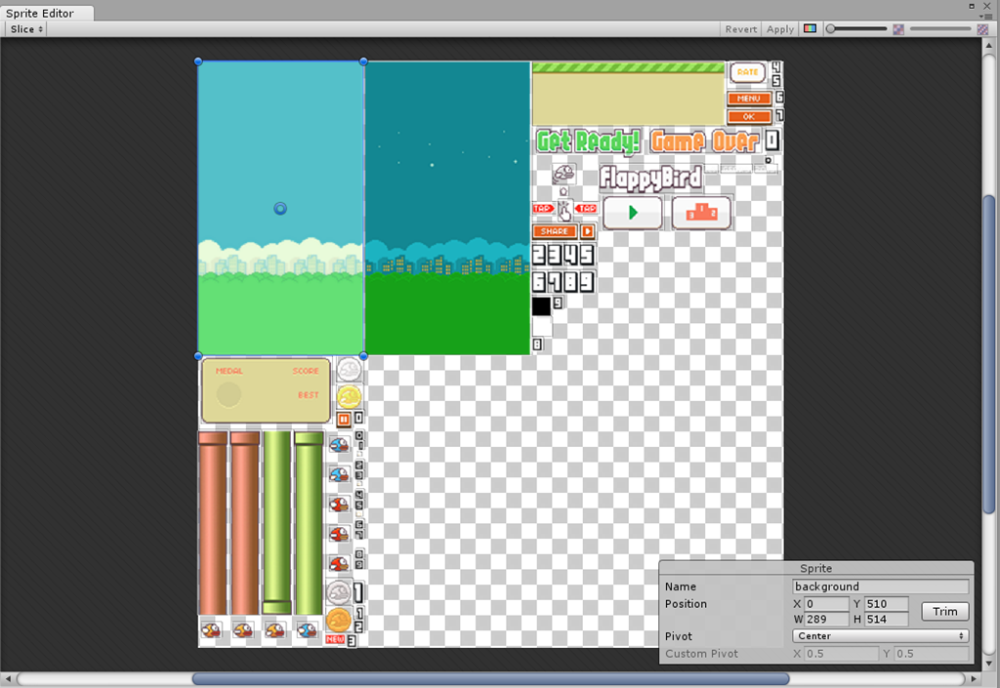

图2-1 Unity3D下可使用贴图的FlappyBird

 

## 七、参考文献


[1]. C#里sqlDataAdapter.fill(DataSet, String)的用法

https://www.cnblogs.com/herizai/p/6972305.html


[2]. C#中sqlDataAdapter的使用小结

https://blog.csdn.net/gatieme/article/details/20695853


[3]. C#中如何设置启动窗口https://bbs.csdn.net/topics/340069897


[4]. C# 中 pictureBox.Image的获得图片路径的三种方法

https://blog.csdn.net/ainmind/article/details/80484443


[5]. 关于C# 引发了"system.indexOutofRangeException"类型异常，该怎么处理

https://blog.csdn.net/a332897696/article/details/6225131?utm_source=blogxgwz9


[6]. C#中gridView常用属性和技巧介绍

https://www.cnblogs.com/zhao123/p/3913772.html


[7]. Flappy Bird-Sound 

https://www.sounds-resource.com/mobile/flappybird/sound/5309/


[8]. Flappy Bird-Picture 

https://www.spriters-resource.com/mobile/flappybird/sheet/59894/


[9]. A Flappy Bird style game in Unity (source code included)

https://dgkanatsios.com/2014/07/02/a-flappy-bird-clone-in-unity-source-code-included-3/


[10]. Flappy Bird style game in Unity 3D

https://github.com/dgkanatsios/FlappyBirdStyleGame


[11]. Unity for all https://unity.com/


[12]. ASP.NET https://dotnet.microsoft.com/apps/aspnet


[13]. C# WPF https://www.c-sharpcorner.com/forums/c-sharp-wpf2


[14]. C# WPF vs WinForm - PEPE YU - 博客园 

https://www.cnblogs.com/PEPE/archive/2012/08/10/2631777.html